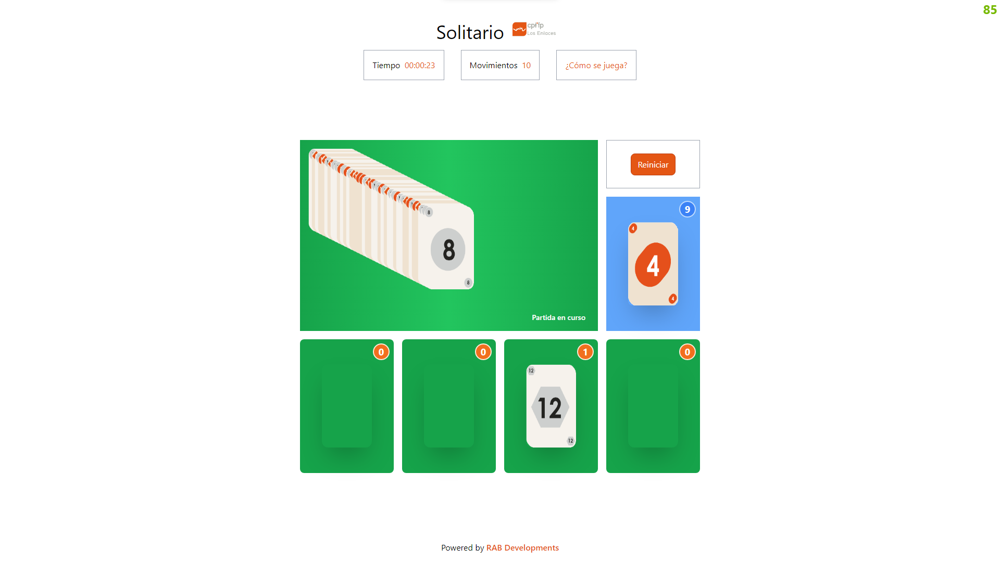
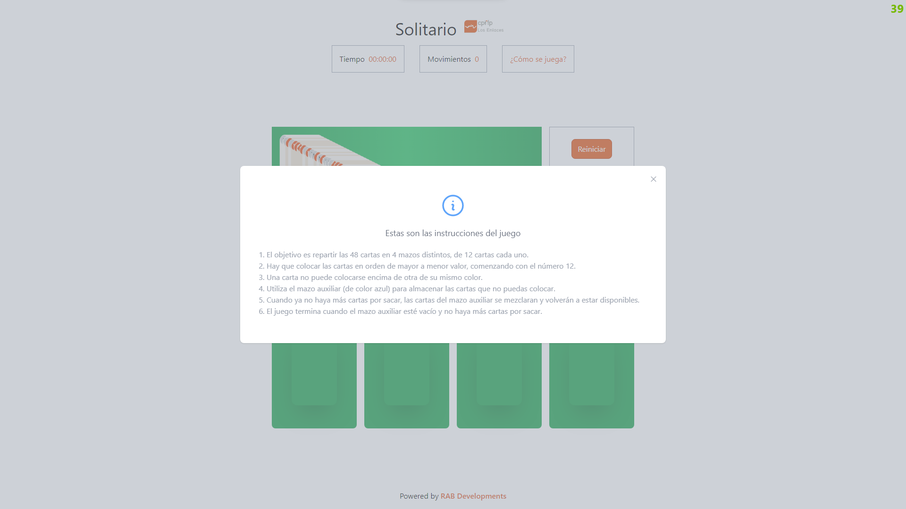
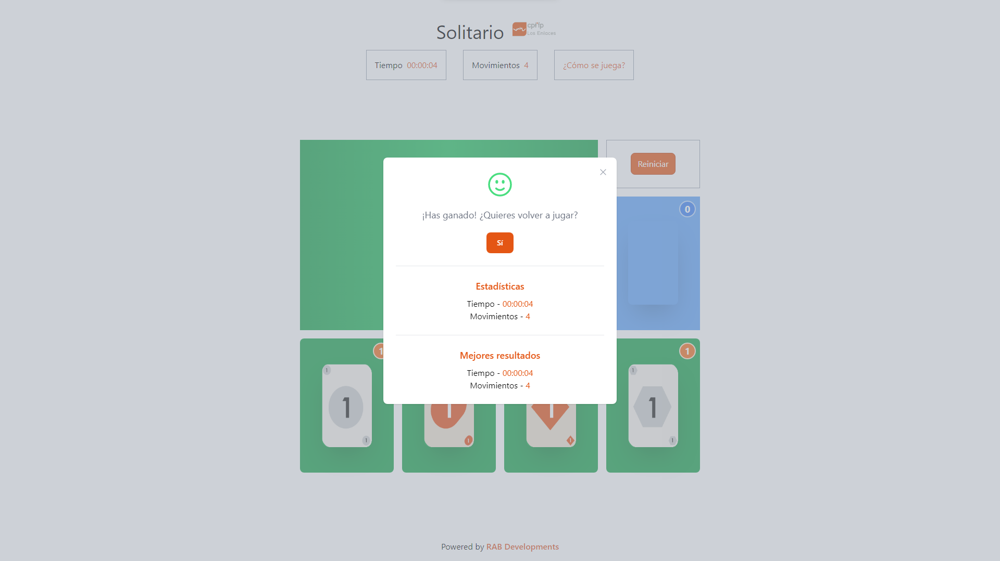
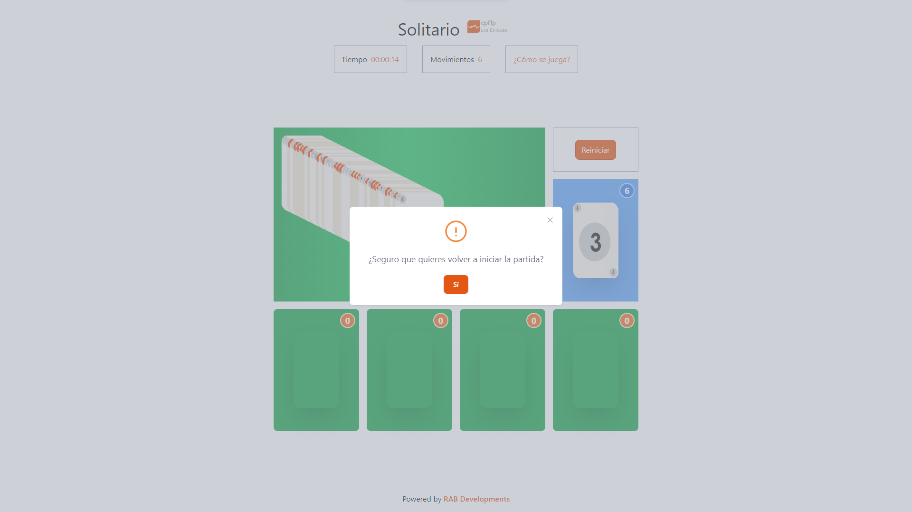

# Índice

-   Introducción
-   Desarrollo
-   Conclusiones
-   Bibliografía

# Introducción

Este proyecto consiste en hacer una versión concreta del juego del solitario, en dónde se parte de 48 cartas, colocadas una encima de otra en diagonal, que hay que ir colocando en 4 mazos distintos. Se debe tener en cuenta que solo se puede jugar la última carta que haya puesta y que se cuenta con un mazo auxiliar para las cartas que no se puedan colocar en ningún mazo. Hay otra serie de reglas que no se van a explicar ahora sino en el apartado del desarrollo. Partiendo de está base ya podemos hacernos una idea del diseño que va tener la web.

Luego explicaremos que tecnologías se van a usar para el desarrollo, pero ya adelantamos que para ejecutar el proyecto se va a necesitar tener instalado Node.js y yarn.

Para instalar las dependencias del proyecto, se debe ejecutar el siguiente comando:

    yarn install

Para ejecutar el proyecto, se debe ejecutar este otro comando:

    yarn dev

El proyecto terminado está disponible en el siguiente enlace: [www.alastuey.ovh](https://www.alastuey.ovh)

-   ## Tecnologías que se van a usar

El **IDE** con el que se va a trabajar es Visual Studio Code, debido a que este es simple de utilizar, y cuenta con decenas de herramientas y extensiones que facilitan el desarrollo.

**El desarrollo se va a hacer con [Nuxt](https://nuxt.com/)**, un framework JS destinado a crear portales web, en su versión 3. Está basado en Vue.js. Fcilita en general el desarrollo con respecto a un proyecto escrito en HTML base.

Hay que tener en cuenta una serie de cuestiones con Nuxt. La primera es que tiene el siguiente cico de vida:


De está imagen nos interesa la última fase del ciclo, Mounted, que es cuando se renderiza el contenido de la página y el DOM está listo para ser manipulado. Aquí es dónde referenciaremos las funciones que queremos que se ejecuten al cargar la página. En Nuxt 3 esta fase del ciclo se la puede llamar con la función **onMounted**, que viene importada por defecto. Luego, en la explicación del código, explicaremos que está pasando en esta función.

Támbien hay que tener en cuenta que Nuxt cuenta con una serie de facilidades, una de ellas es que nos permite incrustar variables de JS en el HTML, para que se puedan renderizar. Esto se hace con la siguiente sintaxis:

    {{ nomnbre de la variable }}

En el caso de que queramos que la variable este dentro de un atributo, se hace de la siguiente manera:

    :nombre del atributo="nombre de la variable" o :nombre del atributo="`/ruta/${nombre de la variable}`"

Los event listeners se hacen de la siguiente manera:

    @nombre del evento="nombre de la función a ejecutar"

Aunque siempre podemos usar la sintaxis de HTML base.

Luego tiene otra serie de funciones como **v-for** o **v-if** que nos permiten hacer bucles y condicionales para el renderizado, dentro en el propio HTML, pero no hemos hecho uso de ellas en el código principal.

Todo el contenido de la web está dentro de la carpeta **src**, la cual contiene otras 3 carpetas:

-   Assets: Contiene un archivo CSS que nos sirve para hacer que Tailwind funcione.
-   Pages: Contiene los archivos **.vue**. En estos es donde se va a desarrollar la web. Luego explicaremos la estructura de estos archivos.
-   Public: Contiene los archivos estáticos, en este caso el logo de la web y las imagenes de las cartas.

Hay otros archivos de configuración que no vamos a explicar, pero que son necesarios para que Nuxt, Tailwind, TypeScript y el repositorio Git funcionen.

La estructura que cumplen los archivos **.vue** es la siguiente:

    <script lang="ts">
        // Aquí va el código TS
    </script>

    <template>
        <!-- Aquí va el HTML -->
    </template>

    <style>
        /* Aquí va el CSS */
    </style>

Para el proyecto hemos creado dos páginas, una llamada **index.vue**, dónde se ejecuta todo el juego, y otra llamada **mobile.vue**, destinada a dispositivos móviles, en la que se muestra un mensaje de que la web no está optimizada para dispositivos móviles o táctiles.

Hacemos uso de **TypeScript**, un lenguaje de programación que se basa en JavaScript, para hacer el código más legible y que sea más fácil de mantener. Además, nos permite hacer uso de las interfaces, que nos permiten definir el tipo de dato que va a tener una variable, y así evitar errores. Se probó a realizar el proyecto con JavaScript, pero este se volvió difícil de depurar.

Como hemos mencionado antes, también vamos a hacer uso de [**Tailwind**](https://tailwindcss.com/), un framework CSS, para crear la interfaz web de una forma sencilla y rápida.

Por último hemos usado dos librerías para crear la interfaz web, una es [**Heroicons**](https://heroicons.com/), que nos permite usar iconos SVG, y la otra es [**Flowbite**](https://flowbite.com/), una extensión de Tailwind que sirve para crear componentes. Está última librería solo se ha usado en los modales.

# Desarrollo

-   ## Interfaz

La interfaz, como ya se ha explicado antes, está contendia por completo entre las etiquetas **template**. Aquí va todo el código HTML. Las reglas CSS se encuentran entre las etiquetas **style**, aunque en este caso apenas se han creado reglas CSS, ya que ha usado Tailwind para casi todo.



Se divide en 2 partes:

-   La primera nos muestra las estadísticas del juego; cantidad de movimientos realizados y tiempo transcurrido. Y un botón para mostrar las intrucciones del juego.

    ```html
    <header class="flex flex-col pt-6 mx-auto select-none">
        <div class="flex flex-row py-4 mx-auto text-center">
            <h1 class="text-4xl">Solitario</h1>
            
        </div>
        <div class="flex flex-row">
            <h3 class="p-4 mx-4 border border-gray-400">
                Tiempo
                <span class="ml-1 text-primary-600">
                    {{ played_time_string }}
                </span>
            </h3>
            <h3 class="p-4 mx-4 border border-gray-400">
                Movimientos
                <span class="ml-1 text-primary-600">
                    {{ amount_movements }}
                </span>
            </h3>
            <button
                data-modal-target="instructions_modal"
                data-modal-toggle="instructions_modal"
                type="button"
                class="p-4 mx-4 border border-gray-400 text-primary-600 hover:text-primary-900">
                ¿Cómo se juega?
            </button>
        </div>
    </header>
    ```

-   La segunda pate de la interfaz contiene el juego en sí, con el tablero inicial de las cartas, los 4 mazos dónde se van a colocar las cartas, el mazo auxiliar y el botón para reiniciar el juego. El tablero principal tiene en la esquina inferior derecha un texto que indica el estado de la partida. Cada mazo tiene un contador que indica la cantidad de cartas que tiene.

    ```html
    <main class="flex h-full py-4">
        <div class="m-auto main_grid w-[48rem] h-[40rem]">
            <!-- Pilas -->
            <div
                @drop="onDrop($event, pile_1.id)"
                @dragover="dragOver($event, pile_1)"
                @dragenter.prevent
                @dragleave="dragLeave($event, pile_1)"
                :id="`pile_${pile_1.id}_box`"
                class="relative flex bg-green-600 rounded-lg pile_1_box">
                <div
                    :id="`pile_${pile_1.id}`"
                    class="w-24 h-40 m-auto shadow-2xl select-none rounded-xl"></div>
                <div
                    class="absolute inline-flex items-center justify-center w-8 h-8 text-lg font-bold text-white border-2 rounded-full select-none border-primary-100 bg-primary-500 top-2 right-2">
                    <span>{{ pile_1.array.length }}</span>
                </div>
            </div>
            <div
                @drop="onDrop($event, pile_2.id)"
                @dragover="dragOver($event, pile_2)"
                @dragenter.prevent
                @dragleave="dragLeave($event, pile_2)"
                :id="`pile_${pile_2.id}_box`"
                class="relative flex bg-green-600 rounded-lg pile_2_box">
                <div
                    :id="`pile_${pile_2.id}`"
                    class="w-24 h-40 m-auto shadow-2xl select-none rounded-xl"></div>
                <div
                    class="absolute inline-flex items-center justify-center w-8 h-8 text-lg font-bold text-white border-2 rounded-full select-none border-primary-100 bg-primary-500 top-2 right-2">
                    <span>{{ pile_2.array.length }}</span>
                </div>
            </div>
            <div
                @drop="onDrop($event, pile_3.id)"
                @dragover="dragOver($event, pile_3)"
                @dragenter.prevent
                @dragleave="dragLeave($event, pile_3)"
                :id="`pile_${pile_3.id}_box`"
                class="relative flex bg-green-600 rounded-lg pile_3_box">
                <div
                    :id="`pile_${pile_3.id}`"
                    class="w-24 h-40 m-auto shadow-2xl select-none rounded-xl"></div>
                <div
                    class="absolute inline-flex items-center justify-center w-8 h-8 text-lg font-bold text-white border-2 rounded-full select-none border-primary-100 bg-primary-500 top-2 right-2">
                    <span>{{ pile_3.array.length }}</span>
                </div>
            </div>
            <div
                @drop="onDrop($event, pile_4.id)"
                @dragover="dragOver($event, pile_4)"
                @dragenter.prevent
                @dragleave="dragLeave($event, pile_4)"
                :id="`pile_${pile_4.id}_box`"
                class="relative flex bg-green-600 rounded-lg pile_4_box">
                <div
                    :id="`pile_${pile_4.id}`"
                    class="w-24 h-40 m-auto shadow-2xl select-none rounded-xl"></div>
                <div
                    class="absolute inline-flex items-center justify-center w-8 h-8 text-lg font-bold text-white border-2 rounded-full select-none border-primary-100 bg-primary-500 top-2 right-2">
                    <span>{{ pile_4.array.length }}</span>
                </div>
            </div>

            <!-- Cartas sobrantes -->
            <div
                @drop="onDrop($event, leftover_pile.id)"
                @dragover="dragOver($event, leftover_pile)"
                @dragenter.prevent
                @dragleave="dragLeave($event, leftover_pile)"
                :id="`pile_${leftover_pile.id}_box`"
                class="relative flex bg-blue-400 leftover_cards_box">
                <div
                    :id="`pile_${leftover_pile.id}`"
                    class="w-24 h-40 m-auto rounded-lg shadow-2xl select-none"></div>
                <div
                    class="absolute inline-flex items-center justify-center w-8 h-8 text-lg font-bold text-white bg-blue-500 border-2 border-blue-200 rounded-full select-none top-2 right-2">
                    <span>{{ leftover_pile.array.length }}</span>
                </div>
            </div>

            <!-- Botón de reinicio -->
            <div class="flex border border-gray-400 select-none buttons_box">
                <button
                    data-modal-target="restart_modal"
                    data-modal-toggle="restart_modal"
                    type="button"
                    class="px-3 py-2 m-auto text-white border rounded-lg border-primary-700 bg-primary-600 hover:bg-primary-500 hover:shadow-lg">
                    Reiniciar
                </button>
            </div>

            <!-- Tablero inicial -->
            <div
                class="flex bg-gradient-to-r from-green-600 via-green-500 to-green-600 main_pile_box">
                <div id="pile_6" class="relative flex w-full h-full m-4">
                    <div
                        class="absolute text-sm font-semibold text-white select-none bottom-8 right-2">
                        <span>{{ game_status_text }}</span>
                    </div>
                </div>
            </div>
        </div>
    </main>
    ```

Al clicar en el botón de las instrucciones, se abre un modal con las instrucciones del juego.



````html
```html
<div
    id="instructions_modal"
    tabindex="-1"
    class="fixed top-0 left-0 right-0 z-50 hidden w-full h-full p-4 overflow-x-hidden overflow-y-auto md:inset-0 h-modal bg-gray-400/50">
    <div class="relative w-full h-full m-auto max-w-fit md:h-auto">
        <div class="relative p-8 bg-white rounded-lg shadow">
            <button
                type="button"
                class="absolute top-3 right-2.5 text-gray-400 bg-transparent hover:bg-gray-200 hover:text-gray-900 rounded-lg text-sm p-1.5 ml-auto inline-flex items-center"
                data-modal-hide="instructions_modal">
                <XMarkIcon class="w-5 h-5" />
                <span class="sr-only">Instrucciones del juego</span>
            </button>
            <div class="p-6 text-center">
                <InformationCircleIcon
                    class="mx-auto mb-4 text-blue-400 w-14 h-14" />
                <h3 class="mb-5 text-lg font-normal text-gray-500">
                    Estas son las instrucciones del juego
                </h3>
                <ul class="text-left text-gray-400 list-decimal">
                    <li v-for="text in instructions">{{ text }}</li>
                </ul>
            </div>
        </div>
    </div>
</div>
````

Lo mismo pasa cuando se gana el juego, se abre otro modal con las estadísticas de la partida actual, y las mejores historicamente, además de un botón para volver a iniciar otra partida.



```html
<button
    type="button"
    data-modal-target="win_modal"
    data-modal-toggle="win_modal"
    id="win_modal_button"
    class="hidden">
    Partida ganada
</button>
<div
    id="win_modal"
    data-modal-backdrop="static"
    data-modal-closable="false"
    tabindex="-1"
    class="fixed top-0 left-0 right-0 z-50 hidden w-full h-full p-4 overflow-x-hidden overflow-y-auto md:inset-0 h-modal bg-gray-400/50">
    <div class="relative w-full h-full max-w-md m-auto md:h-auto">
        <div class="relative bg-white rounded-lg shadow">
            <button
                type="button"
                class="absolute top-3 right-2.5 text-gray-400 bg-transparent hover:bg-gray-200 hover:text-gray-900 rounded-lg text-sm p-1.5 ml-auto inline-flex items-center"
                data-modal-hide="win_modal">
                <XMarkIcon class="w-5 h-5" />
                <span class="sr-only">Partida ganada</span>
            </button>
            <div class="p-6 text-center">
                <FaceSmileIcon class="mx-auto mb-4 text-green-400 w-14 h-14" />
                <h3 class="mb-5 text-lg font-normal text-gray-500">
                    ¡Has ganado! ¿Quieres volver a jugar?
                </h3>
                <button
                    data-modal-hide="win_modal"
                    type="button"
                    @click="restart()"
                    class="text-white bg-primary-600 hover:bg-primary-800 focus:ring-4 focus:outline-none focus:ring-primary-300 font-medium rounded-lg text-sm inline-flex items-center px-5 py-2.5 text-center mx-auto">
                    Sí
                </button>
                <div>
                    <hr class="my-6" />
                    <h3 class="my-2 text-lg font-semibold text-primary-600">
                        Estadísticas
                    </h3>
                    <ul>
                        <li>
                            Tiempo -
                            <span class="text-primary-600">
                                {{ played_time_string }}
                            </span>
                        </li>
                        <li>
                            Movimientos -
                            <span class="text-primary-600">
                                {{ amount_movements }}
                            </span>
                        </li>
                    </ul>
                </div>
                <div>
                    <hr class="my-6" />
                    <h3 class="my-2 text-lg font-semibold text-primary-600">
                        Mejores resultados
                    </h3>
                    <ul>
                        <li>
                            Tiempo -
                            <span class="text-primary-600">
                                {{ best_stats_time_string }}
                            </span>
                        </li>
                        <li>
                            Movimientos -
                            <span class="text-primary-600">
                                {{ best_stats.amount_movements }}
                            </span>
                        </li>
                    </ul>
                </div>
            </div>
        </div>
    </div>
</div>
```

El botón de reiniciar el juego, abre un modal para confirmar que se quiere reiniciar el juego.



```html
<div
    id="restart_modal"
    tabindex="-1"
    class="fixed top-0 left-0 right-0 z-50 hidden w-full h-full p-4 overflow-x-hidden overflow-y-auto md:inset-0 h-modal bg-gray-400/50">
    <div class="relative w-full h-full max-w-md m-auto md:h-auto">
        <div class="relative bg-white rounded-lg shadow">
            <button
                type="button"
                class="absolute top-3 right-2.5 text-gray-400 bg-transparent hover:bg-gray-200 hover:text-gray-900 rounded-lg text-sm p-1.5 ml-auto inline-flex items-center"
                data-modal-hide="restart_modal">
                <XMarkIcon class="w-5 h-5" />
                <span class="sr-only">Reiniciar partida</span>
            </button>
            <div class="p-6 text-center">
                <ExclamationCircleIcon
                    class="mx-auto mb-4 text-primary-400 w-14 h-14" />
                <h3 class="mb-5 text-lg font-normal text-gray-500">
                    ¿Seguro que quieres volver a iniciar la partida?
                </h3>
                <button
                    data-modal-hide="restart_modal"
                    type="button"
                    @click="restart()"
                    class="text-white bg-primary-600 hover:bg-primary-800 focus:ring-4 focus:outline-none focus:ring-primary-300 font-medium rounded-lg text-sm inline-flex items-center px-5 py-2.5 text-center mx-auto">
                    Sí
                </button>
            </div>
        </div>
    </div>
</div>
```

-   ## Lógica del juego

Toda la lógica del juego se encuentra entre las etiquetas **script**. Aquí se encuentra todo el código JavaScript, TypeScript en este caso, que se ejecuta en el navegador del usuario. Casi todo el código está comentado, así que se explicará solo lo más importante.

El código tiene al principio dos _imports_, de las dos librerias que se han usado para crear componentes de la interfaz.

```ts
import { initModals } from 'flowbite'; // Modales hechos a partir de la librería llamada Flowbite.
import {
    ExclamationCircleIcon,
    FaceSmileIcon,
    InformationCircleIcon,
    XMarkIcon,
} from '@heroicons/vue/24/outline'; // Iconos en formato SVG.
```

Después estan las interfaces que se van a usar. Hay dos, Carta y Pila.

```ts
// Objeto carta que guarda: un identificador, el palo de la carta, el valor de la carta, la pila actual en la que se encuentra y la posición en la misma.
interface Card {
    id: number;
    suit: string;
    value: number;
    current_pile: number;
    pile_position: number;
}

// Objeto pila que almacena: un identificador y un array del objeto carta.
interface Pile {
    id: number;
    array: Card[];
}
```

Luego se declaran e inicializan las variables y constantes que se van a usar. Hay algunas que van a actualizarse cuando se ejecuta la función **onMounted**, cuando se renderiza el contenido de la página. Cambiaran o no en función del contenido del **localStorage**.

```ts
// Lista de palos que puede tener una carta (se va a utilizar a la hora de generar las cartas).
const suits = ['oval', 'circle', 'square', 'hexagon'];

// Ajustes del juego, creados para tener una depuración más sencilla.

const cards_per_suite = 1; // Cantidad de cartas que van a haber por palo.
const amount_cards = cards_per_suite * suits.length; // Cantidad de cartas que van a haber en total (cartas por palo por el número total de palos que hay).

// Comprobación de que los ajustes se han establecido bien.
if (cards_per_suite > 12 || cards_per_suite < 1) {
    throw new Error(
        `La cantidad de cartas por mazo debe ser mayor o igual a 1 y menor a 12`
    );
}

// Listado de instrucciones del juego.
const instructions = [
    'El objetivo es repartir las 48 cartas en 4 mazos distintos, de 12 cartas cada uno.',
    'Hay que colocar las cartas en orden de mayor a menor valor, comenzando con el número 12.',
    'Una carta no puede colocarse encima de otra de su mismo color.',
    'Utiliza el mazo auxiliar (de color azul) para almacenar las cartas que no puedas colocar.',
    'Cuando ya no haya más cartas por sacar, las cartas del mazo auxiliar se mezclaran y volverán a estar disponibles.',
    'El juego termina cuando el mazo auxiliar esté vacío y no haya más cartas por sacar.',
];
```

```ts
// Variables del juego que van a ir cambiando.

let amount_movements = 0; // Cantidad de movimientos que ha realizado el usuario en la partida.
let played_time = 0; // Cantidad de tiempo que ha transcurrido desde el comienzo de la partida, en segundos.
let played_time_string = ref('00:00:00'); // Representación del tiempo en formato string, para su correcta visualización en la interfaz del usuario.

var isPlaying = false; // Booleano que indica si la partida esta en transcurso o no.

let initial_pile = { id: 6, array: [] } as Pile; // Creación de la pila incial.
let leftover_pile = { id: 5, array: [] } as Pile; // Creación de la pila auxiliar.

// Creación de las pilas 1 a 4.
let pile_1 = { id: 1, array: [] } as Pile;
let pile_2 = { id: 2, array: [] } as Pile;
let pile_3 = { id: 3, array: [] } as Pile;
let pile_4 = { id: 4, array: [] } as Pile;

// Variable auxiliar que referencia el objeto de la carta actual que está en juego.
let current_playing_card: Card =
    initial_pile.array[initial_pile.array.length - 1];

// String que indica el estado actual de la partida.
let game_status_text = ref('Juego no iniciado');

// String que se va a utilizar para mostrar en la interfaz de usuario cual es el mejor tiempo historico.
let best_stats_time_string = ref('00:00:00');

// Objeto de mejores estadísticas, se crea vacío, pero se define que variables va a tener.
let best_stats = {} as {
    time: number;
    amount_movements: number;
};

// Objeto de mejores estadísticas, se crea vacío, pero se define que variables va a tener. Necesario para guardar el estado del juego cuando el usuario cierra la pestaña.
let current_game_status = {} as {
    isPlaying: boolean;
    time: number;
    amount_movements: number;
    piles: {
        initial_pile: Pile;
        leftover_pile: Pile;
        pile_1: Pile;
        pile_2: Pile;
        pile_3: Pile;
        pile_4: Pile;
    };
};
```

Después viene la parte en la que se crean las funciones, comenzando por la función **start()** y **restart()**. La primera se ejecuta siempre que empiece una partida nueva. La segunda cuando el usuario quiere reiniciar la partida, ya sea por medio del botón o tras ganar una partida. Si **localStorgae** ya tiene una partida guardada, la función **start()** no se va a ejecutar.

```ts
// Función que da comienzo al juego, no devuelve nada. Utilizada al comenzar una partida, ya sea de 0 o por reinicio. No se utiliza cuando ya hay una partida guardada
// en al almacenamiento local.
async function start() {
    initial_pile.array = await shuffleCards(generateCards()); // Se generan las cartas de la pila inicial y luego se mezclan.

    showCards(initial_pile); // Se muestran las cartas de la pila inicial.

    await alignCards(initial_pile.array); // Se alinean de forma escalonada las cartas de la pila inicial.
    await makeDraggable(initial_pile.array[initial_pile.array.length - 1]); // Se establece que la última carta de la pila sea la que se puede jugar.
}

// Función de reinicio de la partida, no devuelve nada. Utilizada cuando el jugador gana o cuando le da al botón de reinicio.
async function restart() {
    clearPiles(); // Se vacian todas las pilas.
    start(); // Se vuelven a generar y mostrar las cartas iniciales.

    // Se establece que la partida ya no está en juego y se resetean a 0 las estadísticas  de la partida.
    isPlaying = false;
    amount_movements = 0;
    played_time = 0;
    played_time_string.value = '00:00:00';
}
```

Las siguientes dos funciones son **endGame()** y **sleep()**. Está última tiene como proposito hacer que el navegador espere un tiempo antes de ejecutar la siguiente instrucción. Se usa para crear efecto visual en la función **alignCards()**. La función **endGame()** se ejecuta cuando el usuario gana la partida, y se encarga de guardar las estadísticas de la partida actual en el **localStorage**, en caso de batir las mejores ya guardadas.

```ts
// Función que se llama cuando el jugador termina una partida, no devuelve nada.
function endGame() {
    setTimeout(() => {
        // Se establece un retraso de 1 segundo para empezar la ejecución.

        // Se establece que la partida ya no está en transcurso.
        isPlaying = false;
        game_status_text.value = 'Partida finalizada';

        // En caso de que las mejores estadísticas históricas hayan sido batidas, estan se sobreescribiran.
        if (best_stats.time == -1 || played_time < best_stats.time) {
            best_stats.time = played_time;
            best_stats_time_string.value = played_time_string.value;
        }

        if (
            best_stats.amount_movements == -1 ||
            amount_movements < best_stats.amount_movements
        ) {
            best_stats.amount_movements = amount_movements;
        }

        // Se establecen las nuevas mejores estadísticas históricas, es posible que estas no hayan cambiado. Se codifican en base64 para que no se puedan leer directamente.
        localStorage.setItem('best_stats', btoa(JSON.stringify(best_stats)));

        // Se muestra el modal del final de partida.
        document.getElementById('win_modal_button')!.click();
    }, 1000);
}

// Función dedicada a parar la ejecución durante una cantidad determinada de milisegundos, que se le pasa como parámetro.
function sleep(ms: number) {
    return new Promise((resolve) => setTimeout(resolve, ms));
}
```

Luego vienen las funciones **generateCards()** y **shuffleCards()**. Ambas funciones devuelven un array del objeto Carta y se ejecutan en la función **start()**. La primera crea las cartas, y la segunda las baraja. Está segunda función también se usa para barajar las cartas del mazo auxiliar, cuando el tablero se vacía.

```ts
// Función que genera un array de cartas y lo devuelve.
function generateCards(): Card[] {
    let pile = [] as Card[];

    let current_suite = 0;
    let current_value = 1;

    // Va generando carta por carta, teniendo en cuenta la cantidad de cartas que se van a generar y la cantidad de palos que hay.
    for (let i = 0; i < amount_cards; i++) {
        const card: Card = {
            id: i,
            suit: suits[current_suite],
            value: current_value,
            current_pile: 6,
            pile_position: i,
        };

        pile.push(card);

        current_value += 1;

        if (current_value > cards_per_suite) {
            current_value = 1;
            current_suite += 1;
        }
    }

    return pile;
}

// Función que devuelve un array de cartas, que se le pasa como parámetro, mezclado de forma aleatoria.
async function shuffleCards(pile: Card[]): Promise<Card[]> {
    let result_pile = pile.sort((a, b) => 0.5 - Math.random()) as Card[];

    result_pile.forEach((card, index) => {
        card.pile_position = index;
    });

    return result_pile;
}
```

Seguimos con la función **addCardToPile()**. Aquí añadimos una carta bien al mazo auxiliar, o a uno de los 4 mazos principales. Tanto el objeto de la carta a añadir como el del mazo al que irá, se pasan como parámetros.

```ts
// Función que agrega un objeto carta a una pila. Tanto la carta como la pila se pasan como parámetro. También se encarga de mostrar en la interfaz dicha agregación. No devuelve nada.
async function addCardToPile(card: Card, pile: Pile) {
    card.pile_position = pile.array.length; // La nueva posición de la carta será igual al tamaño actual de la pila dónde se va a agregar.

    const pile_box = document.getElementById(`pile_${pile.id}`)!; // Se coge el elemento HTML al cual se le va a agregar la carta.
    const card_element = document.createElement('img'); // Se crea el elemento de la carta movida en el HTML.

    card_element.draggable = false; // Se establece que la nueva carta no va a poder moverse.
    card_element.id = `card-${card.id}`; // Se le da el id de la carta al nuevo elemento HTML.
    card_element.src = `/cards/${card.suit}/${card.value}.png`; // Se escoge la imagen que corresponde a la carta.
    card_element.classList.add('absolute', 'w-24', 'h-40', 'rounded-lg'); // Se le añaden las oportunas clases CSS.

    // Si la nueva pila de la carta es la auxiliar, entonces se va a poder mover.
    if (pile.id == 5) {
        card_element.addEventListener('dragstart', (event) => {
            dragStart(event, card);
        });

        card_element.draggable = true;
        card_element.classList.add('cursor-grab');
    }

    card!.current_pile = pile.id; // Se establece la nueva pila en la que está la carta.

    // Se agrega la carta a la nueva pila, tanto en la interfaz como en el objeto.
    pile_box.appendChild(card_element);
    pile.array.push(card);
}
```

Vamos con las funciones **showPileFromLocalStorage()** y **clearPile()**. La primera se va a ejecutar en el caso de que el **localStorage** tenga una partida guardada. Esa comprobación se hará cuando se ejecute la función **onMounted()**, del ciclo de vida de Nuxt. Está función mostrará todas las cartas que contenga el mazo que se le pasa como parámetro. La segunda se ejecuta cuando el usuario quiere reiniciar la partida, o cuando se baraja el mazo auxiliar para volver a colocar las cartas en el tablero. Se encarga de borrar todos los elementos HTML, que se correspondan con las cartas del mazo que se le pasa como parámetro.

```ts
// Esta función se ejecuta en el caso de que haya una partida en transcurso guardada en el almacenamiento local. Se le pasa como parámetro la pila que se va a mostrar
// a partir de los datos guardados. No devuelve nada.
function showPileFromLocalStorage(pile: Pile) {
    // Para cada carta dentro de la pila se crea el elemento HTML y se le establecen los parámetros que correspondan, al igual que se hace en la función addCardToPile.
    pile.array.forEach((card) => {
        const board = document.getElementById(`pile_${pile.id}`)!; // Se coge el elemento HTML al cual se le va a agregar la carta, la pila que le pasamos como parámetro.
        const card_element = document.createElement('img');

        card_element.draggable = false;
        card_element.id = `card-${card.id}`;
        card_element.src = `/cards/${card.suit}/${card.value}.png`;
        card_element.classList.add('absolute', 'w-24', 'h-40', 'rounded-lg');

        // Si el mazo es el auxiliar, entonces se va a poder mover la carta.
        if (pile.id == 5) {
            card_element.addEventListener('dragstart', (event) => {
                dragStart(event, card);
            });

            card_element.draggable = true;
            card_element.classList.add('cursor-grab');
        }

        card_element.addEventListener('dragstart', (event) => {
            dragStart(event, card);
        });

        board.appendChild(card_element); // Se agrega la carta a la interfaz.
    });
}

// Función que borra todos los elementos HTML de una pila, que se pasa como parámetro. No devuelve nada.
function clearPile(pile: Pile) {
    pile.array.forEach((card) => {
        document.getElementById(`card-${card.id}`)!.remove();
    });
}
```

Las próximas funciones son **clearPiles()** y **showCards()**. **clearPiles()** se ejecuta cuando el usuario quiere reiniciar la partida, y se encarga de borrar todas las cartas de los 4 mazos principales, del mazo auxiliar y del tablero. Para ello elimina los elementos HTML haciendo uso de la función **clearPile()** y vacia los arrays. **showCards()** se ejecuta al comenzar una partida nueva, al cargar una partida guardada en el **localStorage** o al barajar el mazo auxiliar. Se encarga de mostrar todas las cartas del mazo que se le pasa como parámetro, creando los elementos HTML correspondientes y añadiéndolos al elemento del propio mazo.

```ts
// Función que vacía todas las pilas, borrando todos los elementos HTML que sean una carta. No devuelve nada.
function clearPiles() {
    clearPile(initial_pile);
    initial_pile.array = [];
    clearPile(leftover_pile);
    leftover_pile.array = [];
    clearPile(pile_1);
    pile_1.array = [];
    clearPile(pile_2);
    pile_2.array = [];
    clearPile(pile_3);
    pile_3.array = [];
    clearPile(pile_4);
    pile_4.array = [];
}

// Función destinada a mostrar las cartas de una pila determinada, que se pasa como parámetro. No devuelve nada.
function showCards(pile: Pile) {
    // Para cada carta de la pila se crea su respectivo elemento HTML y se le establecen los parámetros que corresponda.
    pile.array.forEach((card) => {
        const board = document.getElementById(`pile_${pile.id}`)!;
        const card_element = document.createElement('img');

        card_element.draggable = false;
        card_element.id = `card-${card.id}`;
        card_element.src = `/cards/${card.suit}/${card.value}.png`;
        card_element.classList.add(
            'absolute',
            'w-24',
            'h-40',
            'transform',
            'rounded-lg',
            'select-none'
        );

        card_element.addEventListener('dragstart', (event) => {
            dragStart(event, card);
        });

        board.appendChild(card_element);
    });
}
```

Las funciones **alignCards()**, **makeDraggable()** y **updateTime()** son la que siguen en el código. La primera se encarga de alinear las cartas del tablero, de tal forma que formen una diagonal desde la esquina superior izquierda, dónde cada carta se va a superponer a la siguiente. La segunda hace que sea arrastrable una determinada carta, que se le pasa como parámetro. La tercera aumenta el tiempo en 1 segundo y convierte el tiempo a string, para poder mostrarlo en la interfaz. **alignCards()** se ejecuta cuando el usuario inicia, reinicia o carga una partida, **makeDraggable()** en estos mismos casos, y también cuando el usuario mueve una carta del tablero a uno de los mazos. **updateTime()** se ejecuta cada segundo, se establece dicho bucle en la función **onMounted()**.

```ts
// Función que muestra de forma escalonada las cartas de un array, que se le pasa como parámetro. No devuelve nada.
async function alignCards(cards: Card[]) {
    // Para cada objeto del array se coge el elemento HTML que le corresponda y se le establecen los valores ajustados.
    for (const card of cards) {
        const card_element = document.getElementById(`card-${card.id}`)!;

        card_element.style.top = `${card.pile_position * 3}px`;
        card_element.style.left = `${card.pile_position * 6}px`;
        card_element.style.zIndex = `${card.pile_position}`;

        await sleep(20); // Cada 20 milisegundos se para la ejecución, para dar un efecto visual que simula que las cartas se van colocando poco a poco.
    }
}

// Función que se utiliza para hacer jugable una carta determinada, que se pasa como parámetro. No devuelve nada.
async function makeDraggable(card: Card) {
    const card_element = document.getElementById(`card-${card.id}`)!; // Coge el elemento HTML que le corresponde a la carta.
    card_element.draggable = true; // La hace movible/jugable.
    card_element.classList.add('cursor-grab'); // Agrega un efecto visual vía CSS.
}

// Función que sirve para aumentar el tiempo de juego en 1 segundo (convirtiendo el tiempo a string también). No devuelve nada.
function updateTime() {
    if (!isPlaying) return; // Si no se está jugando, no se actualiza el tiempo.
    played_time += 1;
    played_time_string.value = new Date(played_time * 1000)
        .toISOString()
        .slice(11, 19);
}
```

Ahora vienen las funciones **dragStart()** y **dragLeave()**. La primera se ejecuta cuando el usuario empieza a arrastrar una carta, y la segunda cuando el arrastre de dicha carta pasa a ser fuera de un mazo. **dragStart()** se encarga de guardar la carta que se está arrastrando, de iniciar el contador del tiempo en caso de que no se haya iniciado ya, y de pasar el ID de la carta que estamos moviendo a la función **onDrop()**. **dragLeave()** se encarga de borrar los efectos visuales que se aplican sobre los mazos cuando se arrastra una carta sobre ellos.

```ts
// Función que se ejecuta cuando el event Drag se dispara, esté se le pasa como parámetro. Aparte se le pasa el objeto carta que se está drageando. No devuelve nada.
function dragStart(event: DragEvent, card: Card) {
    event.dataTransfer!.effectAllowed = 'move';
    event.dataTransfer!.setData('cardID', card.id.toString()); // Se establece el ID de la carta que se está drageando para pasarlo a la función drop.

    // En caso de que la partida no haya iniciado aún, el estado pasa a ser 'Partida en curso'.
    if (!isPlaying) {
        isPlaying = true;
        game_status_text.value = 'Partida en curso';
    }

    // Se establece la carta que se está drageando como la carta actual.
    current_playing_card = card;
}

// Función que se ejecuta cuando una carta se dragea fuera de una pila, se le pasa como parámetro el event Drag y la pila sobre la que se está drageando. No devuelve nada.
function dragLeave(event: DragEvent, pile: Pile) {
    const pile_element = document.getElementById(`pile_${pile.id}_box`)!; // Se coge el elemento HTML que le corresponde a la pila.

    // Se aplican unos efectos visuales u otros en función de si la pila sobre la que se está drageando es la pila de cartas restantes o no.
    if (pile.id == leftover_pile.id) {
        pile_element.classList.remove('bg-blue-300');
        pile_element.classList.add('bg-blue-400');
    } else {
        pile_element.classList.remove('bg-green-400');
        pile_element.classList.remove('bg-red-600');
        pile_element.classList.add('bg-green-600');
    }
}
```

Seguimos con una de las funciones principales, **dragOver()**. Esta función se ejecuta cuando el usuario arrastra una carta sobre un mazo. Se encarga de añadir los efectos visuales correspondientes, y de dar luz verde, o no, a la función **onDrop()**. Validará que la carta que se está moviendo se pueda colocar en el mazo, teniendo en cuenta el color, el valor y el palo de la carta que se está moviendo, siguiendo las reglas del juego. Los comentarios en el código explican mejor como funciona.

```ts
// Función que se ejecuta cuando una carta se dragea sobre una pila, se le pasa como parámetro el event Drag y la pila sobre la que se está drageando. No devuelve nada.
function dragOver(event: DragEvent, pile: Pile) {
    const pile_element = document.getElementById(`pile_${pile.id}_box`)!; // Se coge el elemento HTML que le corresponde a la pila.

    // En caso de que la pila sobre la que se está drageando sea la pila de cartas restantes, se aplican los efectos visuales y se da luz verde al drop.
    if (pile.id == leftover_pile.id) {
        pile_element.classList.remove('bg-blue-400');
        pile_element.classList.add('bg-blue-300');
        event.preventDefault();
        return;
    }

    // En principio se da luz verde al drop.
    var isValid = true;

    // El color de la carta que se está drageando se establece en función de su palo.
    const current_color =
        current_playing_card.suit == 'oval' ||
        current_playing_card.suit == 'square'
            ? 'red'
            : 'white';

    // Se establece el color de la última carta de la pila sobre la que se está drageando. En primer lugar se establece como 'not_defined'.
    let last_color = 'not_defined';

    // Si la pila ya tiene el número máximo de cartas que puede tener, no se puede hacer drop.
    if (pile.array.length >= cards_per_suite) {
        isValid = false;
    }

    // Si la pila está vacía, se comprueba que la carta que se está drageando tenga el valor máximo posible.
    if (pile.array.length < 1) {
        if (current_playing_card.value != cards_per_suite) {
            isValid = false;
        }
        // Si la pila no está vacía, se comprueba que la carta que se está drageando tenga el valor inmediatamente inferior al de la última carta de la pila.
    } else {
        last_color =
            pile.array[pile.array.length - 1].suit == 'oval' ||
            pile.array[pile.array.length - 1].suit == 'square'
                ? 'red'
                : 'white'; // Se establece el color de la última carta de la pila.

        if (
            pile.array[pile.array.length - 1].value - 1 !=
            current_playing_card.value
        ) {
            isValid = false;
        }
    }

    // Si la carta que se está drageando tiene el mismo color que la última carta de la pila, no se puede hacer drop.
    if (last_color != 'not_defined') {
        if (current_color === last_color) {
            isValid = false;
        }
    }

    // Se añaden los efectos visuales en función de si el drop es válido o no. En caso de no serlo, se corta la ejecución de la función, así no se da luz verde al drop.
    if (isValid) {
        pile_element.classList.remove('bg-green-600');
        pile_element.classList.add('bg-green-400');
    } else {
        pile_element.classList.remove('bg-green-600');
        pile_element.classList.add('bg-red-600');
        return;
    }

    event.preventDefault();
}
```

Ya solo quedan dos funciones, vamos a comentar primero **onDrop()**. Se ejecuta cuando el usuario suelta una carta sobre un mazo, previa validación de que dicha acción se pueda realizar. Se encarga de añadir la carta al mazo correspondiente, de eliminar la carta del mazo actual o tablero inicial, de actualizar la cantidad de movimientos realizados y de comprobar si el usuario ha ganado la partida. Se ve mejor todo lo que hace en los comentarios del código.

```ts
// Función que se ejecuta cuando se suelta una carta sobre una pila (para ello antes se ha tenido que validar que esto se puede hacer), se le pasa como parámetro el evento Drag
// y el id de la nueva pila de la carta. No devuelve nada.
async function onDrop(event: DragEvent, new_pile_id: number) {
    const cardID = event.dataTransfer!.getData('cardID'); // Se coge el id de la carta que se está dropeando.
    const card =
        initial_pile.array.find((card) => card.id == parseInt(cardID)) ||
        leftover_pile.array.find((card) => card.id == parseInt(cardID)); // Se coge el objeto de la carta que se está dropeando.

    var isOnInitial = card!.current_pile === initial_pile.id ? true : false; // Se comprueba si la carta que se está dropeando está en la pila inicial o en la pila de cartas restantes.

    if (isOnInitial) {
        initial_pile.array.splice(card!.pile_position, 1); // Se elimina la carta de la pila inicial.
    } else {
        leftover_pile.array.splice(card!.pile_position, 1); // Se elimina la carta de la pila de cartas restantes.
    }

    document.getElementById(`card-${card!.id}`)!.remove(); // Se elimina el elemento HTML de la carta que se está dropeando.

    const pile_element = document.getElementById(`pile_${new_pile_id}_box`)!; // Se coge el elemento HTML de la pila sobre la que se está dropeando.

    // Se aplican unos efectos visuales u otros en función de si la pila sobre la que se está dropeando es la pila de cartas restantes o no.
    if (new_pile_id == leftover_pile.id) {
        pile_element.classList.remove('bg-blue-300');
        pile_element.classList.add('bg-blue-400');
    } else {
        pile_element.classList.remove('bg-green-400');
        pile_element.classList.remove('bg-red-600');
        pile_element.classList.add('bg-green-600');
    }

    // Se añade la carta a la pila correspondiente, con la función addCardToPile, a la que se le pasa como parámetros los objetos de la carta y la pila.
    switch (new_pile_id) {
        case 1:
            addCardToPile(card!, pile_1);
            break;
        case 2:
            addCardToPile(card!, pile_2);
            break;
        case 3:
            addCardToPile(card!, pile_3);
            break;
        case 4:
            addCardToPile(card!, pile_4);
            break;
        case 5:
            addCardToPile(card!, leftover_pile);
            break;
    }

    // Se aumenta el número de movimientos en 1.
    amount_movements += 1;

    // Se comprueba si la partida ha terminado, para ello se comprueba si la pila de cartas restantes está vacía y si la pila inicial también lo está.
    if (initial_pile.array.length == 0) {
        if (leftover_pile.array.length == 0) {
            endGame();
            return;
        }

        // Si la pila inicial está vacía pero la de cartar restantes, no, se mezclan las cartas restantes y se vuelven a poner en la pila inicial.

        clearPile(leftover_pile);

        initial_pile.array = await shuffleCards(leftover_pile.array);
        leftover_pile.array = [];

        initial_pile.array.forEach((card) => {
            card.current_pile = 6;
        });

        showCards(initial_pile);
        await alignCards(initial_pile.array);

        game_status_text.value = 'Mezclando las cartas ...';
        setTimeout(() => {
            game_status_text.value = 'Partida en curso';
        }, 2000);
    }

    await makeDraggable(initial_pile.array[initial_pile.array.length - 1]);
}
```

Por último, la función **onMounted()**. Esta función se ejecuta cuando se renderiza la página, como ya hemos comentado en más de una ocasión a lo largo de esta documentación. Se encarga de comprobar si el **localStorage** tiene una partida guardada y cargarla en caso de que así sea, de llamar a la función que actualiza el tiempo cada segundo, de comprobar si la pantalla es táctil o demasiado pequeña, redireccionando a otro apartado de la web en caso afirmativo, de coger las mejores estadísticas guardadas en el **localStorage** en caso de que las haya, y de crear un evento que prevendrá al usuario de recargar la página, o salir de ella, en caso de que esté jugando una partida. Los comentarios del código detallan como realiza cada una de estas tareas.

```ts
onMounted(() => {
    // Se inicializan los modales de Flowbite que hemos importado al principio del archivo.
    initModals();

    // Se ejecuta la función updateTime cada segundo.
    setInterval(() => updateTime(), 1000);

    // Se comprueba si el dispositivo es táctil o no.
    var isTouchScreen = 'ontouchstart' in window;

    // Si el dispositivo es táctil o la pantalla es menor de 800px de ancho, se redirige al url "/mobile", en dónde se indica que el juego no está adaptado para ser jugado
    // en dichos dispositivos.
    if (window.screen.availWidth < 800 || isTouchScreen) {
        navigateTo('mobile');
    }

    // Se comprueba si hay una mejor puntuación guardada en el localStorage. Si no hay, se crea un objeto con los valores por defecto (-1). Se usan las funciones atob y btoa para
    // codificar y decodificar el objeto a base64.
    best_stats = JSON.parse(
        atob(
            localStorage.getItem('best_stats') ||
                btoa('{"time": -1, "amount_movements": -1}')
        )
    );

    // Se pasa el dato del mejor tiempo a un string para poder mostrarlo en el HTML.
    best_stats_time_string.value = new Date(best_stats.time * 1000)
        .toISOString()
        .slice(11, 19);

    // Se comprueba si hay una partida guardada en el localStorage. Si no la hay, se crea un objeto vacío. Se usan las funciones atob y btoa para codificar y decodificar el objeto a base64.
    current_game_status = JSON.parse(
        atob(localStorage.getItem('current_game_status') || btoa('{}'))
    );

    // Se comprueba si la partida guardada está en curso. Si es así, se carga la partida.
    if (current_game_status.isPlaying) {
        isPlaying = current_game_status.isPlaying; // Se establece que la partida está en curso.
        played_time = current_game_status.time; // Se establece el tiempo de juego que se tenía guardado.
        amount_movements = current_game_status.amount_movements; // Se establece el número de movimientos que se tenía guardado.

        // Se establecen las pilas que se tenían guardadas.
        initial_pile = current_game_status.piles.initial_pile;
        leftover_pile = current_game_status.piles.leftover_pile;
        pile_1 = current_game_status.piles.pile_1;
        pile_2 = current_game_status.piles.pile_2;
        pile_3 = current_game_status.piles.pile_3;
        pile_4 = current_game_status.piles.pile_4;

        // Se muestran las cartas que se tenían guardadas.

        showPileFromLocalStorage(leftover_pile);
        showPileFromLocalStorage(pile_1);
        showPileFromLocalStorage(pile_2);
        showPileFromLocalStorage(pile_3);
        showPileFromLocalStorage(pile_4);

        showCards(initial_pile);

        alignCards(initial_pile.array);
        makeDraggable(initial_pile.array[initial_pile.array.length - 1]);

        game_status_text.value = 'Partida en curso';
    } else {
        // En caso de no haber una partida guardada, se inicia una nueva.
        start();
    }

    // Se establece un evento que se ejecuta cuando se cierra la página, cuando hay un partida en curso.
    // Aquí se pregunta si se está seguro de querer salir y se guarda la partida en curso en el localStorage.
    window.onbeforeunload = function (event) {
        if (!isPlaying) {
            return;
        }
        // Objeto que contiene el estado de la partida en curso.
        current_game_status = {
            isPlaying: isPlaying,
            time: played_time,
            amount_movements: amount_movements,
            piles: {
                initial_pile: initial_pile,
                leftover_pile: leftover_pile,
                pile_1: pile_1,
                pile_2: pile_2,
                pile_3: pile_3,
                pile_4: pile_4,
            },
        };

        // Se guarda la partida en curso, codificada, en el localStorage.
        localStorage.setItem(
            'current_game_status',
            btoa(JSON.stringify(current_game_status))
        );

        event.returnValue = '¿Seguro que quieres salir?';
    };
});
```

# Conclusiones

# Webgrafía

-   https://nuxt.com
-   https://tailwindcss.com
-   https://heroicons.com
-   https://flowbite.com
-   https://developer.mozilla.org
